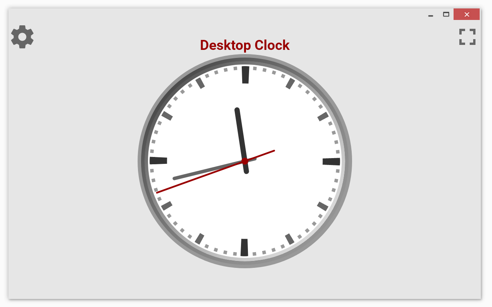
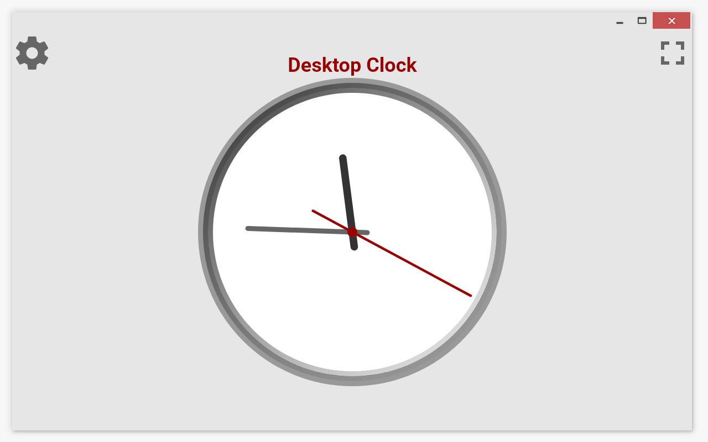
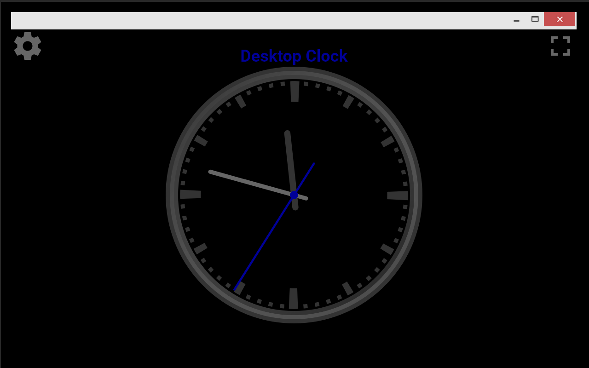
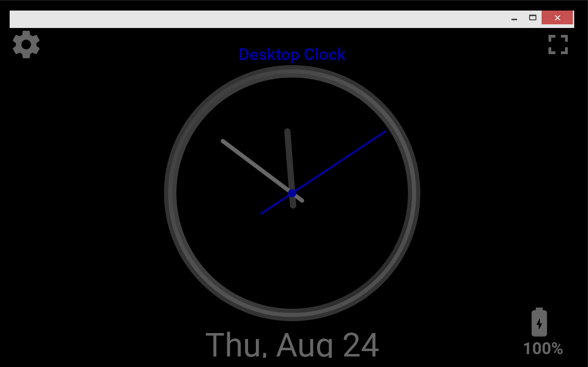
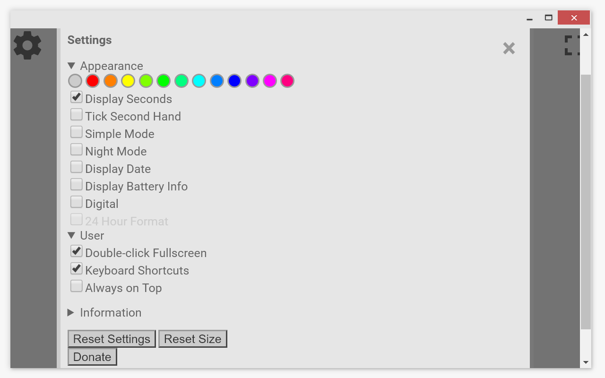
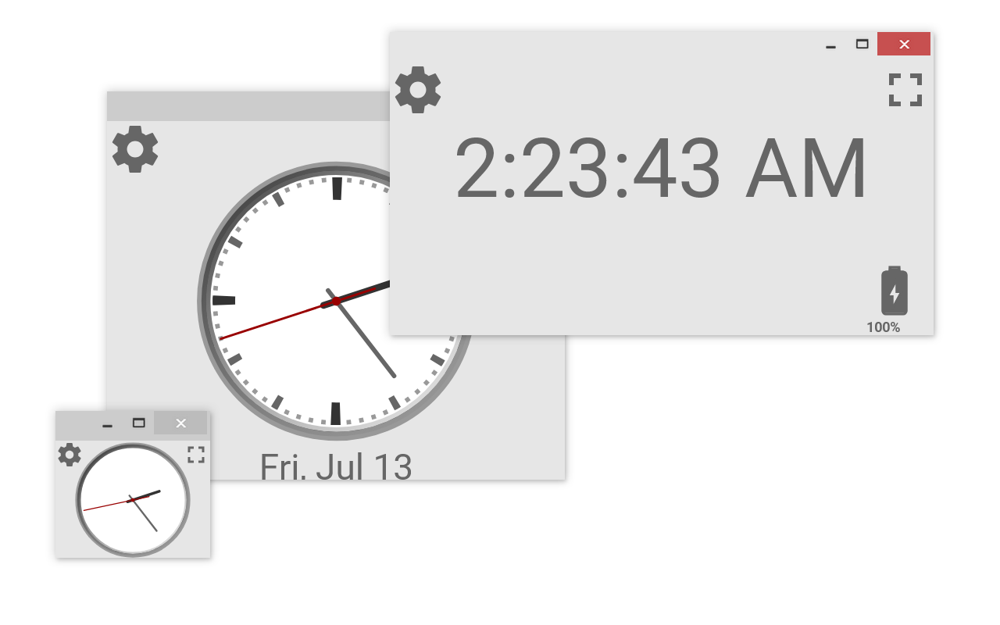

  
    
  
  
  
  

Desktop Clock is a simple, resizable, customizable, clock app.

Options:
 - Ticking, sweeping, or hidden second hand
 - Simple mode
 - Night mode, black background, and 12 themes
 - Digital and analog displays
 - Display date and/or battery level
 - Doubleclick fullscreen
 - Keyboard shortcuts
 - Always on top mode
 - Open ultiple instances of Desktop Clock
 - Small file size (<1mb)
 - Saves you settings automatically
 - Available in English, Spanish, French, German, and Russian
 - Desktop Clock is a vector, so it resizes perfectly on any screen, regardless of size or pixel density.

Desktop Clock was the first chrome web app I published. After a year or two, it got very popular and I got many feature requests and some notices of bugs. Since then, I've added many user requested features, including always on top mode, a ticking second hand, analog mode, themes, the option to resize Desktop Clock into an extremly small size, the option to open multiple clocks, and the option to remove the title bar.

The entire app is written in plain HTML, CSS, and Javascript, so the app can run offline with a very small file size.

The entire app, and all promotional images and assets, descriptions, and the trailer were all designed by me.

You can find the app on the [Chrome web store](https://chrome.google.com/webstore/detail/desktop-clock/fioeniclklclkopakbepllehmbfikpcc).

