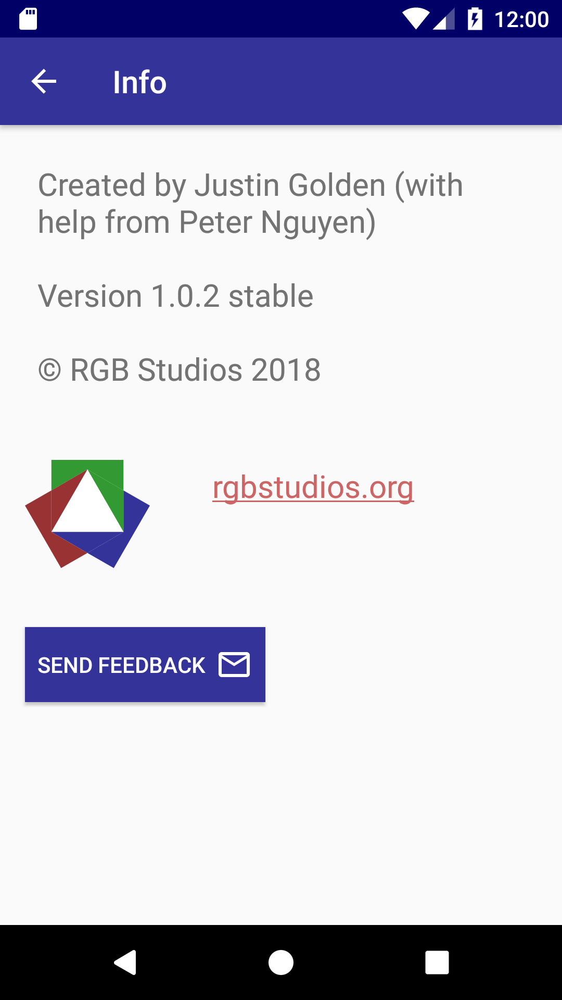
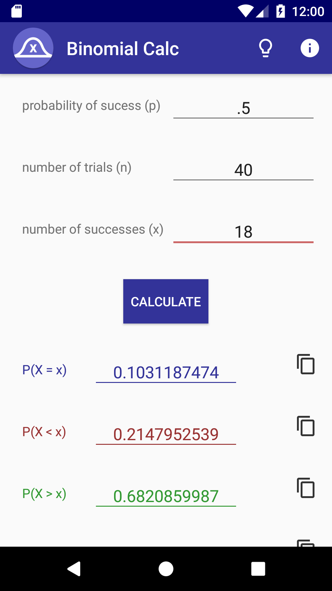
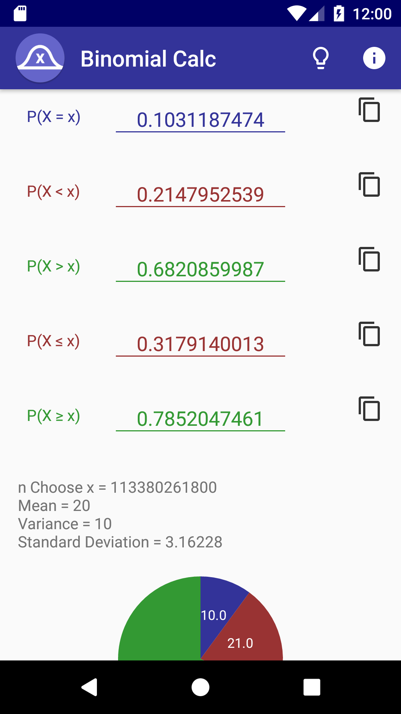
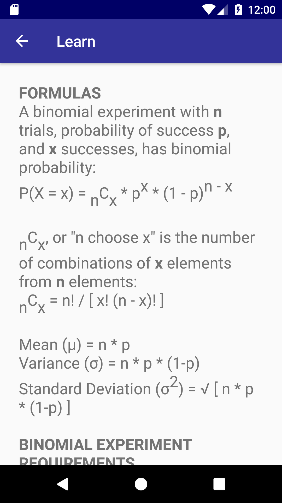

  
  
  
  
  

Binomial Calc is a simple, efficient, and powerful binomial distribution calculator.

Binomial Calc was the first android app I've published. I've doodled with many other android apps before, but it's the first one I've finished to the point of being prepared to release. It's based off of the website that I made [here](http://rgbstudios.org/binomial-calc/).

The app was created in Android Studio, primarily with Java and XML.

The app is currently less than 2mb.

The entire app, and all promotional images, other assets, and descriptions were all designed by me.

You can find the app on the [Google Play Store](https://play.google.com/store/apps/details?id=org.rgbstudios.binomialdistributioncalculator).

